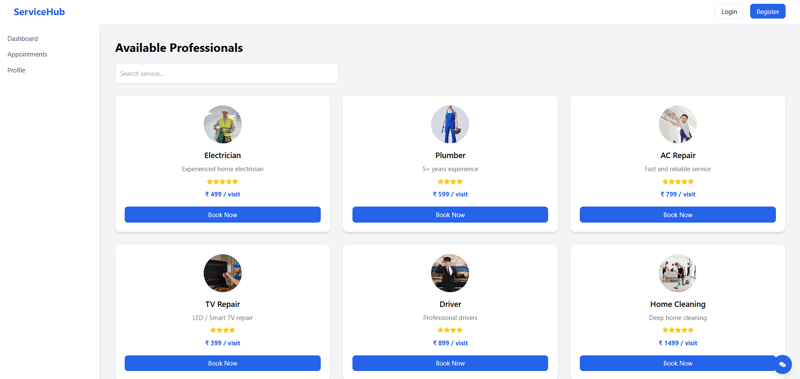

🚀 ServiceHub – Full Stack Service Booking Platform

ServiceHub is a full-stack web application that allows users to explore services, book appointments, and manage their profiles through an interactive dashboard.

The project demonstrates integration between a React frontend, Spring Boot backend, and MySQL database.

## 📸 Screenshots

### 🏠 Homepage

### 📊 Dashboard

✨ Features

User registration and login

Interactive service dashboard

Search functionality to filter services

Book service using booking modal

Appointments page to view booked services

User profile page with logout functionality

Protected routes for authenticated users

Dynamic UI updates using React Hooks

🛠 Tech Stack
Frontend

React.js

React Router

Tailwind CSS

JavaScript (ES6)

Backend

Java

Spring Boot

Spring Security

REST APIs

Database

MySQL

JPA / Hibernate

Tools

Git & GitHub

VS Code

Postman

📂 Project Structure
servicehub
│
├── servicehub-frontend
│   ├── components
│   ├── pages
│   └── App.jsx
│
└── servicehub-backend
    ├── controller
    ├── service
    ├── repository
    └── model
▶️ How to Run
Backend
cd servicehub-backend
mvn spring-boot:run

Runs on:
http://localhost:8080

Frontend
cd servicehub-frontend
npm install
npm run dev

Runs on:
http://localhost:5173

📚 Concepts Demonstrated

React component-based architecture

React Hooks (useState)

React Router navigation

Conditional rendering

Dynamic service listing

REST API integration

Full-stack development

👨‍💻 Author

Sai Reddy
Aspiring Full Stack Developer 🚀
